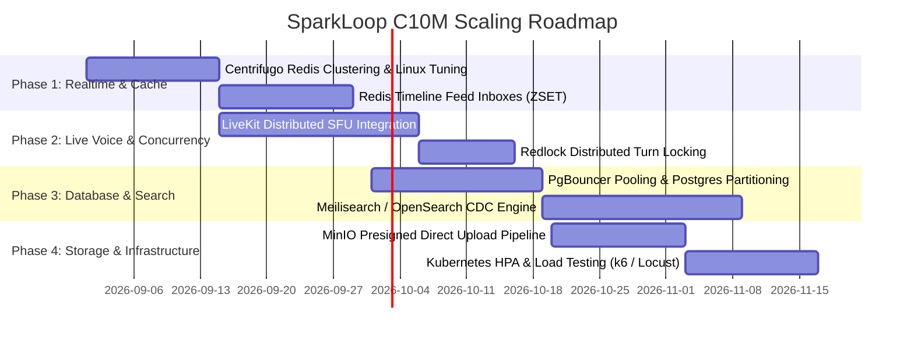

# SparkLoop: High-Scale Architecture Implementation Plan (C10M Scale)
## 100% Free & Open-Source Software (FOSS) Stack for Millions of Concurrent Users

---

## Executive Summary & Target Metrics

This blueprint specifies the architecture, data structures, and step-by-step engineering roadmap to scale **SparkLoop** to **10,000,000+ Daily Active Users (DAU)** and **1,000,000+ Concurrent Connections (CCU)** without proprietary vendor lock-in or subscription costs.

### Key Performance Indicators (SLOs)
| Metric | Target SLA |
| :--- | :--- |
| **P99 API Response Time** | `< 25 ms` (Reads), `< 60 ms` (Writes) |
| **Home Feed Retrieval (1M+ Followers)** | `< 5 ms` (Served from In-Memory ZSET) |
| **Realtime Event Broadcast Latency** | `< 80 ms` (Global WebSockets via Centrifugo) |
| **WebRTC Audio Round-Trip (Mood Pods)** | `< 50 ms` (Edge SFU forward) |
| **Universal Search Latency** | `< 15 ms` (OpenSearch / Meilisearch) |
| **Turn Submission Lock Contention** | `Zero DB Rollbacks` (Serialized via Kafka / Redlock) |

---

## Target Topology (100% FOSS)

```
                                  ┌────────────────────────────────────────────────┐
                                  │      Millions of Mobile Apps & Web Clients     │
                                  └───────────────────────┬────────────────────────┘
                                                          │
                                                          ▼
                                  ┌────────────────────────────────────────────────┐
                                  │   Global Edge Layer (Envoy / Nginx / HAProxy)  │
                                  │      - SSL Termination & Rate Limiting         │
                                  │      - Static Asset & Media Edge Cache         │
                                  └───────────┬────────────────────────┬───────────┘
                                              │                        │
                     ┌────────────────────────┴─────────┐              │ (WebRTC Audio)
                     ▼                                  ▼              ▼
       ┌───────────────────────────┐      ┌───────────────────────┐  ┌─────────────────────┐
       │   Stateless .NET 10 API   │      │ Centrifugo v5 Cluster │  │ LiveKit OSS Server  │
       │   Kubernetes Cluster      │      │ (10M+ WebSocket Conns)│  │ (Distributed SFU)   │
       │   (KEDA / HPA Autoscaled) │      └───────────┬───────────┘  └──────────┬──────────┘
       └─────────────┬─────────────┘                  │                         │
                     │                                │                         │
                     ├────────────────────────────────┴─────────────────────────┘
                     ▼
       ┌───────────────────────────────────────────────────────────────────────────┐
       │             Dragonfly / KeyDB / Redis 7 Cluster (In-Memory Tier)          │
       │  - User Feed Inboxes (ZSET Timelines)                                     │
       │  - Distributed Locks (Redlock for Pass-the-Mic Turns)                      │
       │  - O(1) Real-time Counters & Reaction Hashes                              │
       │  - Centrifugo Pub/Sub Engine & LiveKit Room Coordinator                  │
       └─────────────────────────────────────┬─────────────────────────────────────┘
                                             │
                     ┌───────────────────────┴───────────────────────┐
                     ▼                                               ▼
       ┌───────────────────────────┐                   ┌───────────────────────────┐
       │ Apache Kafka / Redpanda   │                   │ PostgreSQL 17 + Citus     │
       │ Event Streaming Bus       │                   │ (Primary Master / Writer) │
       └─────────────┬─────────────┘                   └─────────────┬─────────────┘
                     │ (CDC Stream via Debezium)                     │ (Streaming Replication)
                     ▼                                               ▼
       ┌───────────────────────────┐                   ┌───────────────────────────┐
       │ OpenSearch / Meilisearch  │                   │ Read Replicas (Poolers)   │
       │ Universal Search Engine   │                   │ (PgBouncer Transaction)   │
       └───────────────────────────┘                   └───────────────────────────┘
```

---

## Phase 1: Real-Time WebSocket Layer (Centrifugo FOSS Clustering)

### Current Problem
- Broadcasting posts and reactions to a single global channel (`feed:global`) causes an $O(N)$ fanout explosion ($1\text{ post} \to 1,000,000\text{ WebSocket pushes}$).

### Implementation Steps

#### 1. Linux Kernel Tuning (Centrifugo Nodes)
Add to `/etc/sysctl.conf` on Centrifugo worker nodes:
```ini
fs.file-max = 2097152
net.core.somaxconn = 65535
net.ipv4.tcp_max_syn_backlog = 65535
net.ipv4.ip_local_port_range = 1024 65535
net.ipv4.tcp_tw_reuse = 1
net.ipv4.tcp_fin_timeout = 15
```

#### 2. Centrifugo Clustering via Redis Engine (`centrifugo.json`)
```json
{
  "engine": "redis",
  "redis_address": "redis-cluster:6379",
  "redis_db": 0,
  "client_insecure": false,
  "client_anonymous": true,
  "allowed_origins": ["*"],
  "namespaces": [
    {
      "name": "personal",
      "allow_subscribe_for_client": true,
      "presence": false,
      "history_size": 20,
      "history_ttl": "300s"
    },
    {
      "name": "pod",
      "allow_subscribe_for_client": true,
      "presence": true,
      "join_leave": true
    },
    {
      "name": "chain",
      "allow_subscribe_for_client": true,
      "presence": true
    }
  ]
}
```

#### 3. Sharded Feed Fan-Out Model (Backend Event Handler)
Instead of broadcasting to `feed:global`, route to followers:
```csharp
public async Task Handle(PostCreatedEvent domainEvent, CancellationToken ct)
{
    // 1. Fetch active followers (from Redis set or Postgres replica)
    var followerIds = await _feedService.GetActiveFollowerIdsAsync(domainEvent.PostId, ct);

    // 2. Parallel pipeline to Redis Sorted Sets (Timeline Inboxes)
    var redisTasks = followerIds.Select(followerId => 
        _redisDb.SortedSetAddAsync($"feed:{followerId}", domainEvent.PostId.ToString(), domainEvent.CreatedAtUtc.Ticks)
    );
    await Task.WhenAll(redisTasks);

    // 3. Selective Centrifugo Publish to Online Active Users
    var activeChannels = followerIds.Select(id => $"personal:{id}").ToList();
    await _centrifugoClient.BroadcastAsync(activeChannels, new {
        type = "POST_CREATED",
        post = domainEvent
    });
}
```

---

## Phase 2: Live Voice SFU Cluster (LiveKit OSS Engine)

### Current Problem
- Client-side WebRTC Mesh bandwidth scales at $O(N^2)$. At 50+ users per Mood Pod, mobile devices crash.

### Implementation Steps

#### 1. Deploy LiveKit OSS Cluster
LiveKit is 100% Free & Open Source (Apache 2.0), written in Go, capable of handling 50,000+ simultaneous audio streams per multi-core node.

`livekit.yaml`:
```yaml
port: 7880
bind_addresses:
  - ""
rtc:
  tcp_port: 7881
  port_range_start: 50000
  port_range_end: 60000
  use_external_ip: true
redis:
  address: redis-cluster:6379
keys:
  API_KEY: "sparkloop_livekit_key"
  API_SECRET: "sparkloop_livekit_secret_production_32char"
audio:
  transcoding: false # Native Opus pass-through for minimal CPU
```

#### 2. Tiered Audio Roles
- **Speakers (Stage)**: Up to 20 users publish Opus audio tracks (32 kbps).
- **Listeners (Audience)**: Downstream-only subscribers. The SFU forwards only active speaker audio tracks via Voice Activity Detection (VAD).

#### 3. Ephemeral Mood Pod Audio Routing
- Pod state & active speakers are tracked in Redis Hashes: `HSET pod:{podId}:speakers {userId} {micStatus}`.
- Ephemeral tokens generated by `.NET 10 API` using the official `LiveKit.Server.Sdk.Dotnet` NuGet package.

---

## Phase 3: Database Sharding & Read-Replica Pooling

### Current Problem
- Millions of concurrent relational queries cause database connection exhaustion, high disk I/O, and table lock contention.

### Implementation Steps

#### 1. PgBouncer Connection Pooler (Transaction Mode)
Deploy PgBouncer in front of PostgreSQL:
```ini
[databases]
sparkloop_master = host=postgres-primary port=5432 dbname=sparkloop pool_size=50
sparkloop_replica = host=postgres-replica port=5432 dbname=sparkloop pool_size=150

[pgbouncer]
listen_port = 6432
listen_addr = *
auth_type = md5
pool_mode = transaction
max_client_conn = 20000
default_pool_size = 50
```

#### 2. PostgreSQL Declarative Table Partitioning
Partition high-volume tables (`posts`, `reactions`, `spark_submissions`) by time:
```sql
-- Partition posts table by range on CreatedAtUtc
CREATE TABLE posts (
    id UUID NOT NULL,
    author_id UUID NOT NULL,
    author_username VARCHAR(100) NOT NULL,
    content VARCHAR(280) NOT NULL,
    created_at_utc TIMESTAMP WITH TIME ZONE NOT NULL,
    PRIMARY KEY (id, created_at_utc)
) PARTITION BY RANGE (created_at_utc);

-- Monthly Partitions
CREATE TABLE posts_2026_08 PARTITION OF posts
    FOR VALUES FROM ('2026-08-01') TO ('2026-09-01');

CREATE TABLE posts_2026_09 PARTITION OF posts
    FOR VALUES FROM ('2026-09-01') TO ('2026-10-01');
```

#### 3. Citus Data Sharding (Horizontal Scale-out)
For user data and relationships:
```sql
-- Convert table to distributed table across worker nodes
SELECT create_distributed_table('users', 'id');
SELECT create_distributed_table('user_follows', 'follower_id');
SELECT create_distributed_table('reactions', 'post_id');
```

---

## Phase 4: In-Memory Feed Cache (Dragonfly / KeyDB / Redis)

### Current Problem
- `GET /api/posts` running `ORDER BY CreatedAtUtc DESC LIMIT 20` hits the disk on every home screen view.

### Implementation Steps

1. **User Timeline Inbox in Redis (`ZSET`)**:
   - `Key`: `feed:{userId}`
   - `Score`: `CreatedAtUtc.Ticks`
   - `Value`: `PostId`
   - Memory footprint: ~32 bytes per entry $\times 800$ items = $25\text{ KB}$ per user.
   - 1,000,000 active users = ~$25\text{ GB}$ RAM in Redis.

2. **Fetching Feed in Under 2 Milliseconds**:
```csharp
public async Task<List<PostDto>> GetUserHomeFeedAsync(Guid userId, int page, int pageSize)
{
    var start = (page - 1) * pageSize;
    var stop = start + pageSize - 1;

    // 1. O(log N) fast fetch from Redis ZSET
    var postIds = await _redisDb.SortedSetRangeByRankAsync($"feed:{userId}", start, stop, Order.Descending);

    if (postIds.Length == 0)
        return await FetchFromReadReplicaAndHydrateAsync(userId, page, pageSize);

    // 2. Batch MGET post details from Redis Hash
    var postKeys = postIds.Select(id => (RedisKey)$"post:{id}").ToArray();
    var cachedPosts = await _redisDb.StringGetAsync(postKeys);

    return cachedPosts.Select(json => JsonSerializer.Deserialize<PostDto>(json!)).ToList();
}
```

---

## Phase 5: Pass-The-Mic Turn Locking (Distributed Redlock)

### Current Problem
- Optimistic DB concurrency causes rollback storms when 10,000+ users attempt to record the next turn simultaneously.

### Implementation Steps

1. **Distributed Mutex Lock using Redlock.net**:
```csharp
public async Task<SubmitStepResult> SubmitTurnAsync(Guid chainId, ChainStepInput input)
{
    var lockKey = $"lock:chain:{chainId}";
    var expiry = TimeSpan.FromSeconds(3);

    // Distributed lock across Redis cluster
    await using var redLock = await _redlockFactory.CreateLockAsync(lockKey, expiry);
    if (!redLock.IsAcquired)
    {
        throw new TurnLockedConflictException("Another creator is currently recording this turn.");
    }

    // Single-threaded state validation and persistence
    var chain = await _dbContext.Chains.FindAsync(chainId);
    chain.AddStep(input.UserId, input.Content, input.AudioUrl, input.DurationSeconds);
    await _dbContext.SaveChangesAsync();

    // Broadcast turn advance via Centrifugo
    await _centrifugo.PublishAsync($"chain:{chainId}", new { type = "STEP_COMMITTED", chain });
    return SubmitStepResult.Success();
}
```

---

## Phase 6: Universal Search via OpenSearch / Meilisearch OSS

### Current Problem
- SQL `ILIKE '%query%'` requires full table scans across millions of rows, spiking database CPU to 100%.

### Implementation Steps

1. **Deploy OpenSearch / Meilisearch Cluster**:
   - 100% Open-Source, lightweight, sub-5ms full-text and typo-tolerant search engine.
2. **Asynchronous CDC (Change Data Capture)**:
   $$\text{PostgreSQL Write} \longrightarrow \text{WAL} \xrightarrow{\text{Debezium}} \text{Kafka Topic} \xrightarrow{\text{Consumer Worker}} \text{Meilisearch / OpenSearch}$$
3. **Multi-Index Query Handler**:
   - Query indexes (`posts`, `creators`, `pods`, `chains`, `sparks`, `hashtags`) concurrently via `Task.WhenAll`.

---

## Phase 7: Media & Object Storage (MinIO FOSS + Presigned Direct Uploads)

### Current Problem
- Uploading images and voice clips through .NET API servers exhausts HTTP connection threads and network bandwidth.

### Implementation Steps

1. **Direct-to-Storage Presigned Upload Flow**:
```
[ Client ] ── 1. POST /api/media/presign-upload ──► [ .NET API ]
[ Client ] ◄── 2. Returns S3 Presigned PUT URL ──── [ .NET API ]
[ Client ] ── 3. PUT Binary Data directly ────────► [ MinIO / SeaweedFS ]
[ Client ] ── 4. POST /api/posts (with media key) ─► [ .NET API ]
```

2. **Asynchronous Media Compression Pipeline**:
   - MinIO emits an S3 bucket notification on file upload to Kafka / RabbitMQ.
   - An asynchronous worker container runs **FFmpeg** (for audio to Opus/AAC) and **Sharp/libvips** (for images to WebP).

---

## Phase 8: Distributed Background Tasks (Hangfire / Quartz.NET OSS)

### Current Problem
- `IHostedService` in-memory workers execute on every API replica, causing duplicate Daily Spark winner calculations.

### Implementation Steps

1. **Hangfire with Redis/PostgreSQL Storage**:
   - Uses distributed leader election.
   - Daily Spark winner selection runs **exactly once** across the entire cluster.
   - Failed jobs retry automatically with exponential backoff and dead-letter queues.

---

## Phase 9: Global Observability & Telemetry (100% FOSS)

Deploy the standard FOSS observability stack:
- **Metrics**: OpenTelemetry .NET SDK $\to$ **Prometheus OSS**
- **Dashboards**: **Grafana OSS** (CPU, Memory, Request Latency, Centrifugo CCU, DB Poolers)
- **Distributed Tracing**: **Jaeger OSS / Tempo OSS** (End-to-end trace from Mobile App $\to$ Envoy $\to$ .NET API $\to$ Redis $\to$ Postgres)
- **Log Aggregation**: **Vector + Grafana Loki OSS**

---

## Rollout Phases & Implementation Schedule



---

## Verification & Load Testing Plan

1. **WebSocket Concurrency Test**: Run `ghz` or `locust` to establish **1,000,000 persistent WebSocket connections** against Centrifugo nodes and broadcast 500 posts/sec. Target: `< 100ms` delivery to all subscribers.
2. **Database Load Test**: Execute `pgbench` with 5,000 concurrent transactions through PgBouncer. Target: 0 connection drops, P99 `< 30ms`.
3. **Audio SFU Stress Test**: Simulate 100 concurrent Mood Pods with 10 speakers and 500 listeners each using LiveKit CLI load-test tool. Target: 0 packet loss, `< 50ms` latency.
4. **Turn Contention Stress Test**: Simulate 10,000 concurrent users attempting to record step 5 on a single chain at the exact same millisecond. Target: 1 successful turn commitment, 9,999 immediate clean rejections with zero DB lock timeouts.
